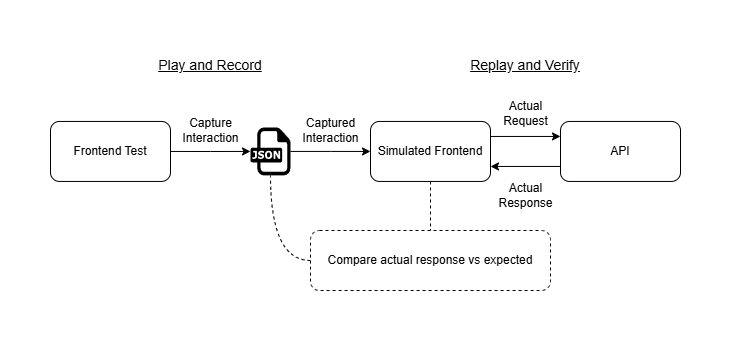
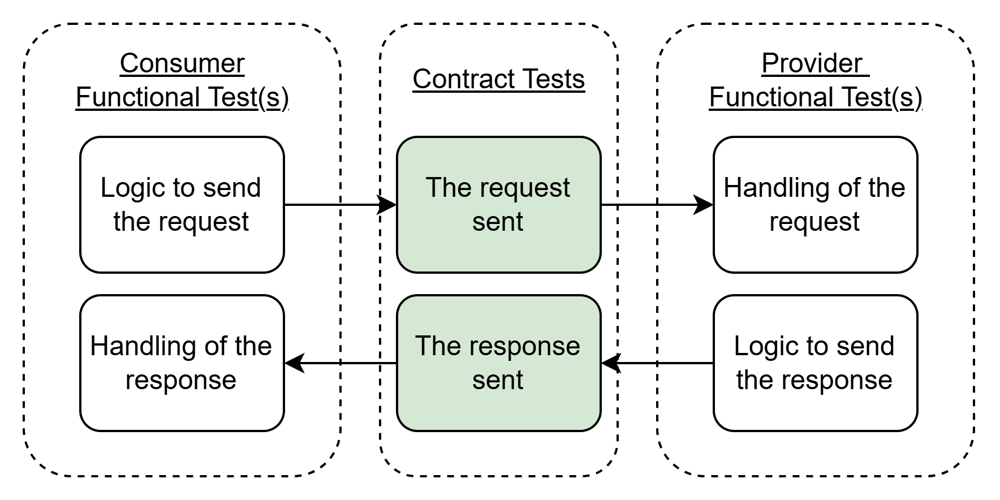

In a microservice world, it's not uncommon to end up with many services that communicate and depend on one another, and for those services to be maintained by independent teams. It is also not uncommon for teams to create mock dependencies so that they can evolve their service without dependeding on, or interfering with, other teams.

Mock dependencies are often time-consuming to create and maintain, and they don't always provide the confidence needed about the system's final behaviour. This usually forces us to rely on extensive end-to-end testing for feedback which simply isn't scalable.

## A Better Way

One way to solve this is through **consumer driven contract testing** - an approach that _ensures_ two separate services are compatible by requiring both sides to come to a consensus on the allowed set of interactions between them.

This works by having a test that captures expected interactions (requests, responses) from a consumer's perspective, and making them separately accessible to the provider so that it can replay those interactions against itself without needing the consumer, or independent mocks.

## What _Isn't_ Being Tested

Contract testing is purely focused on guarding against _contract violations_ within the messages being exchanged between services. It is not really suitable for anything beyond this, such as functional testing.

It is typically the responsiblity of the respective team to ensure their service builds and sends messages as expected, and handles what is done with the data recieved.

## Conclusion

This approach allows testing actual consumer expectations against actual provider capabilities with reduced reliance on mocks without needing to deploy. This allows teams to independently evolve their services and get near instant feedback on how those changes impact neighbouring services.

Tools like Pact make setting this up very straight forward, and provide a lot more utilities around this, such as deployability of changes based on service version compatibility.

Check out this [demo project](https://github.com/Ty-R/contract-testing-demo) if interested in seeing contract testing and Pact in action.
